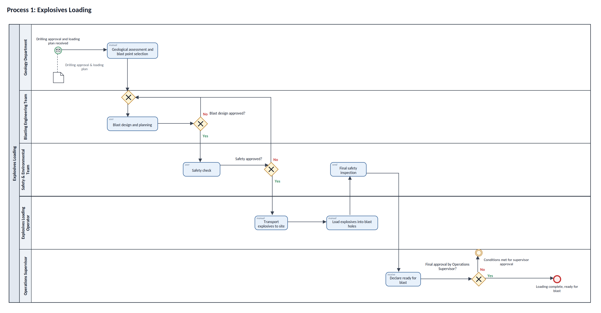
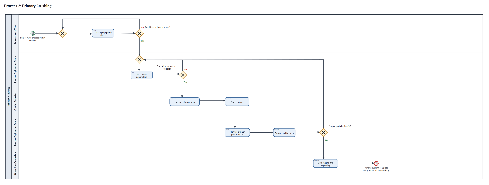
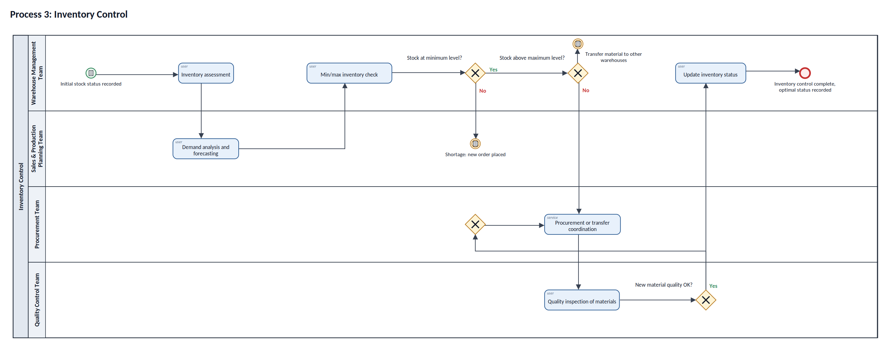
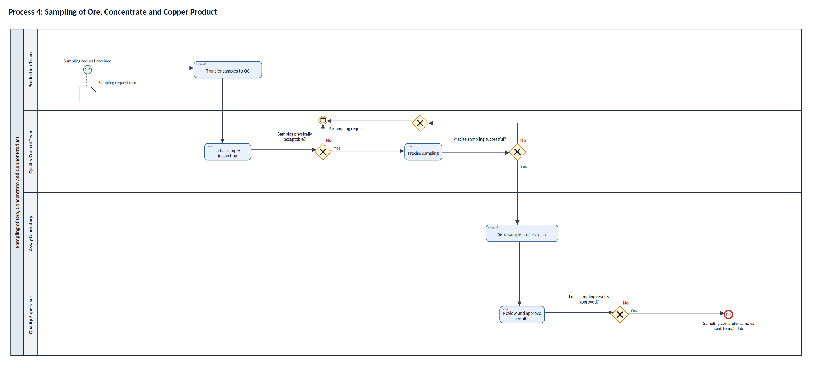
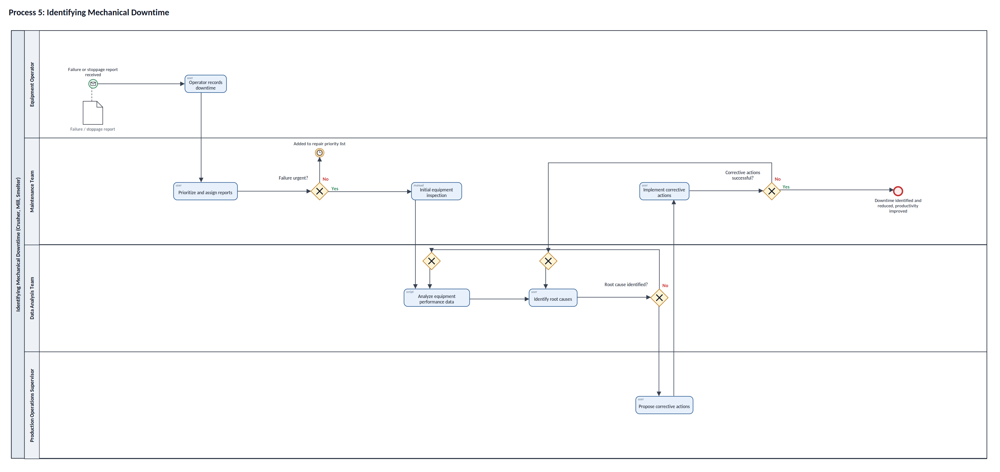

# Phase 1: BPMN 2.0 Process Models

The five processes defined in [Phase 0](../Phase_0_Process_Selection) were modeled as **BPMN 2.0** diagrams in **Visual Paradigm**. Each diagram is a pool with one swimlane per role and uses:

- **Typed tasks**: user, manual, service, script, send and receive tasks
- **Exclusive (XOR) gateways** for every decision, plus merge gateways for loops back to earlier steps
- **Start events** with message and conditional triggers, and message end events
- **Intermediate events**: timer, message and conditional (rule) events
- **Data objects** connected with associations (such as the drilling approval document or the failure report)

The Visual Paradigm project is [`BPMN_Models.vpp`](BPMN_Models.vpp). The labels in the original model are in Persian. The images below are English versions rebuilt from the same model file, with the same layout and flows.

| # | Process | Lanes | Tasks | Gateways |
|---|---|---:|---:|---:|
| 1 | Explosives loading | 5 | 7 | 4 |
| 2 | Primary crushing | 5 | 7 | 5 |
| 3 | Inventory control | 4 | 6 | 4 |
| 4 | Sampling of ore, concentrate and copper product | 4 | 5 | 4 |
| 5 | Identifying mechanical downtime | 4 | 7 | 5 |

### 1. Explosives Loading

### 2. Primary Crushing

### 3. Inventory Control

### 4. Sampling of Ore, Concentrate and Copper Product

### 5. Identifying Mechanical Downtime

