# Phase 2: Dataset, ERD and SQL Server Database

In this phase I generated a synthetic operational dataset for the copper processing plant in Excel, designed the entity-relationship model in three steps, built the database in **Microsoft SQL Server** and wrote **14 analytical T-SQL queries**.

Original Persian report: [`Phase2_Report_FA.pdf`](Phase2_Report_FA.pdf)

## Contents

| Path | Description |
|---|---|
| [`Dataset_EN.xlsx`](Dataset_EN.xlsx) | Full dataset with English table, column and category names |
| [`Dataset_Original_FA.xlsx`](Dataset_Original_FA.xlsx) | Original dataset (Persian), as used in SQL Server and Power BI |
| [`data/`](data) | One CSV file per table (English) |
| [`sql/01_schema.sql`](sql/01_schema.sql) | `CREATE TABLE` script with primary keys, foreign keys and 1:1 constraints |
| [`sql/02_load_data.sql`](sql/02_load_data.sql) | Loads the CSV files with `BULK INSERT` |
| [`sql/Q01…Q14`](sql) | The 14 analytical queries (English identifiers) |
| [`sql/persian_original/`](sql/persian_original) | The same queries as originally written against the Persian column names |
| [`erd/`](erd) | ERD in draw.io format (English and Persian) and the three design steps |
| [`screenshots/`](screenshots) | SQL Server Management Studio screenshots of every table and query result |

> The database I built in SQL Server used the Persian column names from the Excel file (visible in the screenshots). For this repository I also produced an English version of the dataset, schema and queries. The English schema and all 14 English queries were test-run against the data.

---

## 1. Dataset

The dataset has **10 tables** (one Excel sheet per entity). Most tables have 152 daily records covering **1 January to 1 June 2025**. `ProcessUnit` has 20 units and `ShiftStaff` has 150 employees. In each sheet the first column is the primary key and, where there is one, the last column is the foreign key.

Values were generated with Excel formulas (such as `RANDBETWEEN`, `IF`, and normal distributions built from `AVERAGE` and `STDEV.S`), then fixed as values so they stay the same in the later phases.

| Table | Records | How the data was generated |
|---|---:|---|
| **ShiftReport** | 152 | Report time between 08:00 and 17:00: `=TIME(7,RANDBETWEEN(0,540),RANDBETWEEN(0,59))`. Shift code A, B or C: `=CHAR(RANDBETWEEN(65,67))`. Shift A (morning) and C last 4 hours, shift B (lunch) 1 hour: `=IF(D2="B",1,4)`; other hours count as overtime. 50–100 staff per shift. Urgent shift flag 0/1. Shift efficiency 50–70% for the first 100 reports and 60–85% after that. Reporting unit 1–4. |
| **ProductFlow** | 152 | Products 1–10 and destinations 1–10 from a random number turned into a name with `IF` (`=IF(M2=M2,"Destination "&M2,)`). Quantity 50–70 for the first 100 records, then 60–100. Input, output, recovered and rejected tonnage follow a normal distribution (absolute value taken). |
| **ProcessUnit** | 20 | Unit names and types based on a real concentrator plant (flotation, comminution, storage, conveying, dewatering and so on). Efficiency is random; machine counts and capacities were researched. |
| **MaterialFlow** | 152 | Material type (feed, concentrate, tailings, return) from `RANDBETWEEN(1,4)` and nested `IF`. Weight from a normal distribution. Waste 5–20%, based on research. Input type 0 = primary, 1 = secondary. |
| **ChemicalAnalysis** | 152 | Test type (Conductivity, TDS, pH) from a random number and `IF`. Test result 0 = successful, 1 = unsuccessful. Copper percentage from a normal distribution. |
| **RecoveryIndicators** | 152 | Recovery rate 70–90%, based on research. Process type physical, chemical or hybrid. Recovery cost 90–210 million tomans. |
| **EnergyUsage** | 152 | Energy type electricity, gas or water. Consumption 1,000–5,000 units. Cost 500,000–2,000,000. |
| **WarehouseStock** | 152 | Material type and warehouse (final, return, fines) from random numbers and `IF`. Quantity 100–300. |
| **ShiftStaff** | 150 | Names from AI-generated sample data. Role operator, engineer or manager. Performance 40–80%. Overtime 1–3 hours. |
| **Shipment** | 152 | Copper percentage and dry weight from normal distributions. 20–100 barrels. Destination from a random number and `IF`. Shipping cost 2–10 million tomans. Status 0 = awaiting shipment, 1 = shipped. |

---

## 2. Entity-Relationship Diagram

The entities are the Excel sheets and their attributes are the sheet columns. I drew the ERD in draw.io in three steps:

1. **Step 1**: entities, primary keys and the first relationships ([`ERD_step1_FA.png`](erd/ERD_step1_FA.png))
2. **Step 2**: entities turned into tables with all attributes ([`ERD_step2_FA.png`](erd/ERD_step2_FA.png))
3. **Step 3**: relationships corrected and foreign keys highlighted ([`ERD_step3_FA.png`](erd/ERD_step3_FA.png), English version: [`ERD_final_EN.drawio`](erd/ERD_final_EN.drawio), [`ERD_final_EN.png`](erd/ERD_final_EN.png))

Final model (English):

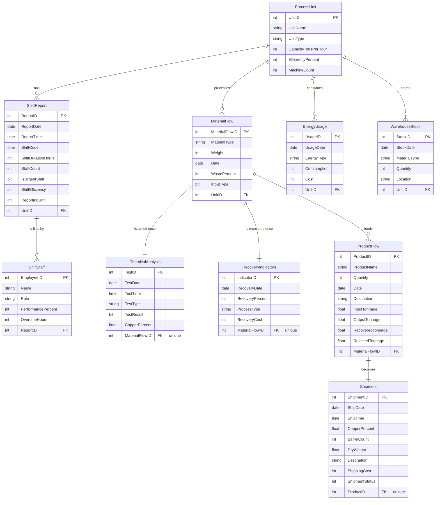

**Relationships**

- **ShiftReport → ProcessUnit (many-to-one)**: each shift report belongs to one process unit, and a unit has many reports.
- **ProductFlow ↔ Shipment (one-to-one)**: by the project assumptions, every product flow ends up as exactly one shipment.
- **MaterialFlow ↔ ChemicalAnalysis (one-to-one)**: every material flow is tested exactly once.
- **MaterialFlow ↔ RecoveryIndicators (one-to-one)**: every material flow goes through exactly one recovery round.
- **MaterialFlow → ProcessUnit (many-to-one)**: a unit can use many material flows.
- **ShiftStaff → ShiftReport (many-to-one)**: a daily report can combine input from several employees.
- **WarehouseStock → ProcessUnit (many-to-one)**: stock is recorded daily, and each unit sends material to several stock records.
- **EnergyUsage → ProcessUnit (many-to-one)**: consumption is recorded daily for each unit.

---

## 3. Tables in SQL Server

Each table was created in SQL Server Management Studio from its Excel sheet, and the relationships were then added in a database diagram to match the ERD. Screenshots of all 10 tables are in [`screenshots/`](screenshots), for example:

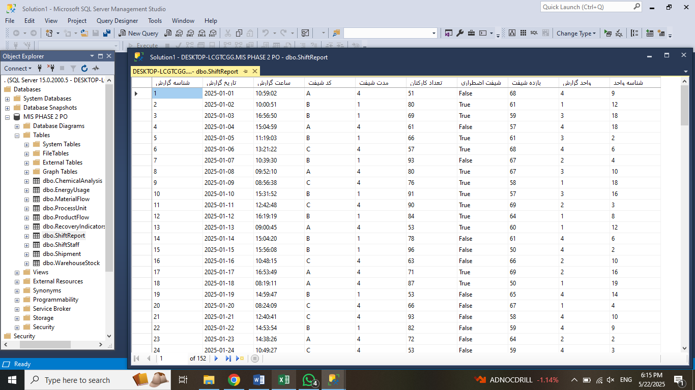

To rebuild the database from this repository, run [`01_schema.sql`](sql/01_schema.sql) and then [`02_load_data.sql`](sql/02_load_data.sql).

---

## 4. Analytical Queries

The queries cover the period January–June 2025 and use window functions (`LAG … OVER`), correlated subqueries, joins, `CASE` aggregation and monthly grouping.

| # | Query | What it answers |
|---|---|---|
| 1 | [Energy cost change by type](sql/Q01_energy_cost_change_by_type.sql) | How the cost of each energy type changes over time |
| 2 | [Materials in high-efficiency shifts](sql/Q02_materials_in_high_efficiency_shifts.sql) | Which materials are used most in shifts above 80% efficiency |
| 3 | [Products with rising output](sql/Q03_products_with_rising_output.sql) | Which products show an increasing production trend |
| 4 | [Material use vs. shift efficiency](sql/Q04_material_use_vs_shift_efficiency.sql) | Material consumed per unit next to that unit's average shift efficiency |
| 5 | [Monthly unit efficiency](sql/Q05_monthly_unit_efficiency.sql) | Average efficiency of process units by month |
| 6 | [Monthly warehouse stock](sql/Q06_monthly_warehouse_stock.sql) | Change in stock by material over six months |
| 7 | [Monthly shift efficiency](sql/Q07_monthly_shift_efficiency.sql) | Average shift efficiency by month |
| 8 | [Monthly energy by type](sql/Q08_monthly_energy_by_type.sql) | Electricity, gas and water consumption per month |
| 9 | [Monthly test results by type](sql/Q09_monthly_test_results_by_type.sql) | Total, successful and failed tests per test type and month |
| 10 | [Processes with most successful recovery](sql/Q10_processes_with_most_successful_recovery.sql) | Which recovery processes succeed most often, and their average recovery rate |
| 11 | [Shipments by destination and month](sql/Q11_shipments_by_destination_and_month.sql) | Total weight and number of shipments per destination |
| 12 | [Recovery vs. shift efficiency](sql/Q12_recovery_vs_shift_efficiency.sql) | Relationship between recovery rate and shift efficiency |
| 13 | [Daily shipment weight change](sql/Q13_daily_shipment_weight_change.sql) | Day-to-day change in shipped weight |
| 14 | [Monthly successful test trend](sql/Q14_monthly_successful_test_trend.sql) | Month-over-month change in successful chemical tests |

Example (query 1):

```sql
SELECT
    EnergyType,
    UsageDate,
    SUM(Cost) AS TotalCost,
    SUM(Cost) - LAG(SUM(Cost)) OVER (PARTITION BY EnergyType ORDER BY UsageDate) AS CostChange
FROM EnergyUsage
WHERE UsageDate BETWEEN '2025-01-01' AND '2025-06-01'
GROUP BY EnergyType, UsageDate
ORDER BY EnergyType, UsageDate;
```

<details>
<summary>Query results in SQL Server (screenshots)</summary>

| | |
|---|---|
| **Q1** 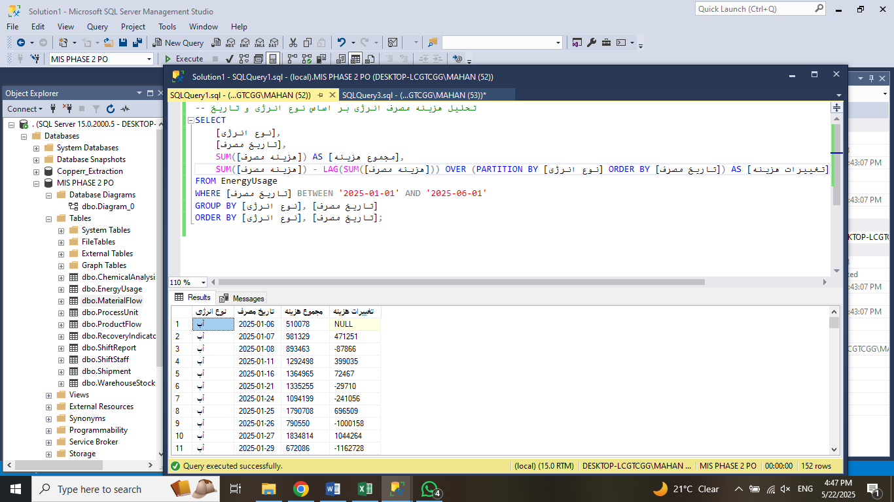 | **Q2** 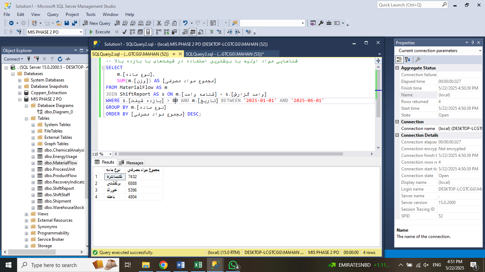 |
| **Q3** 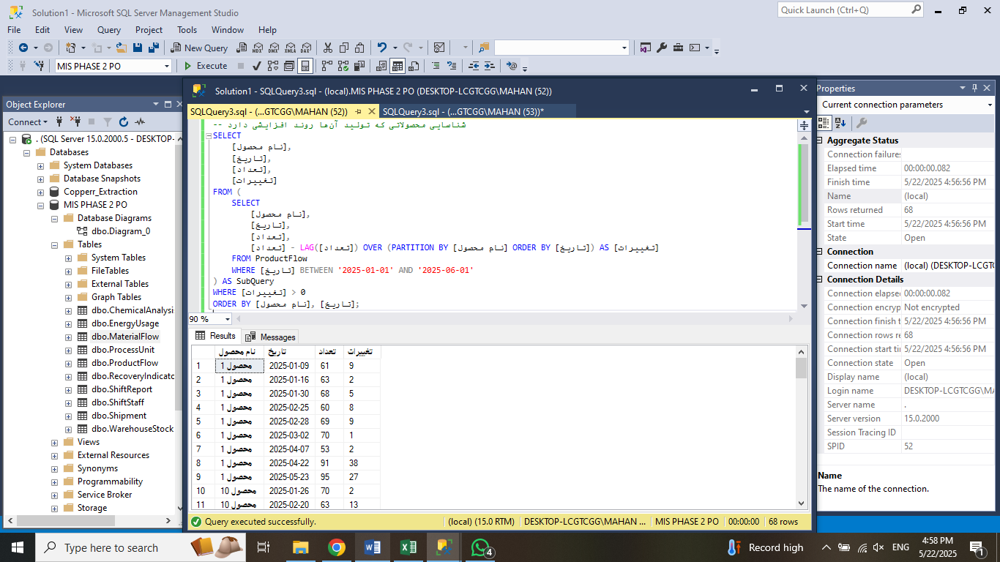 | **Q4** 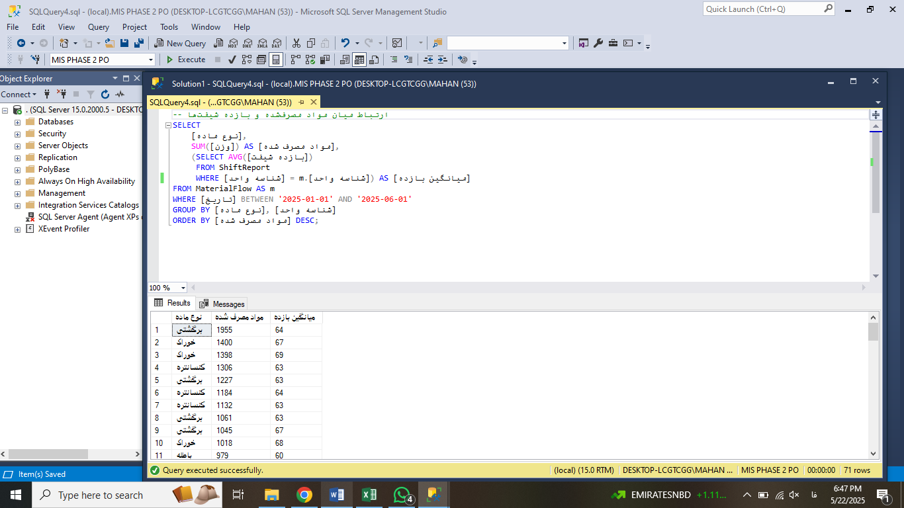 |
| **Q5**  | **Q6** 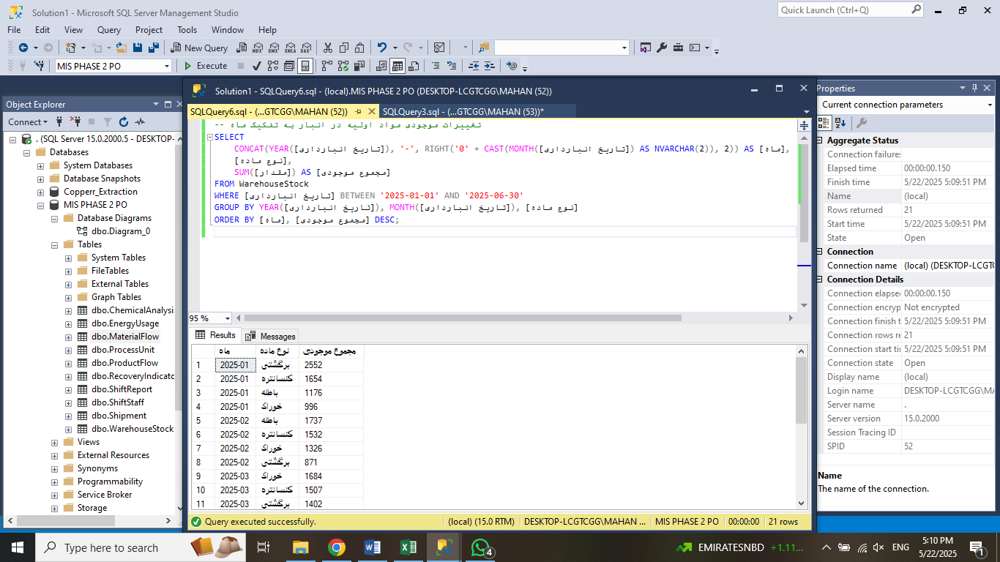 |
| **Q7** 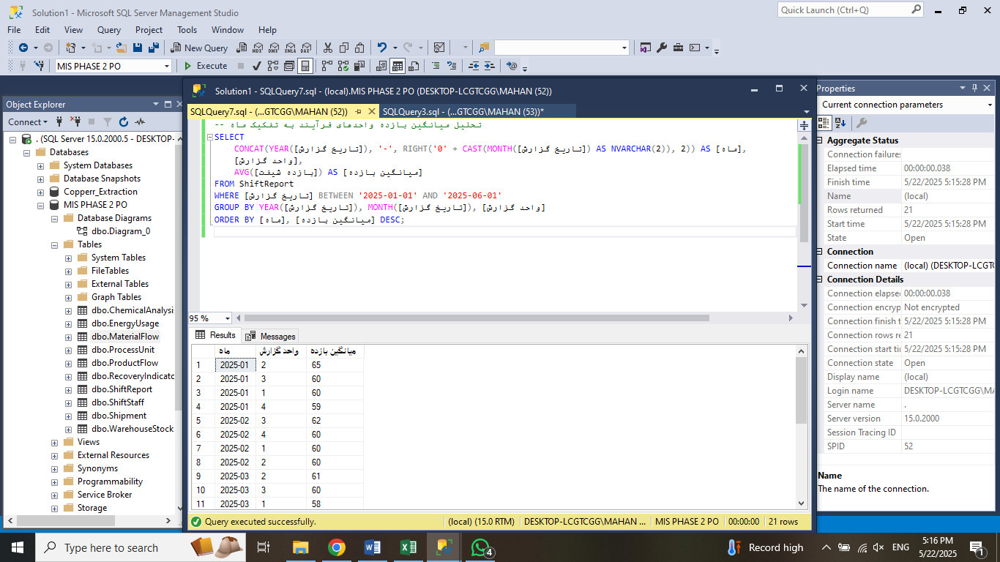 | **Q8**  |
| **Q9** 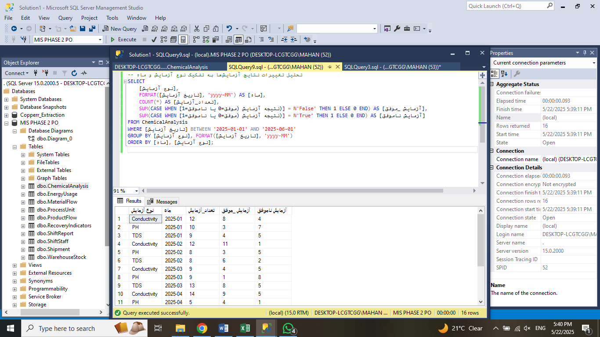 | **Q10** 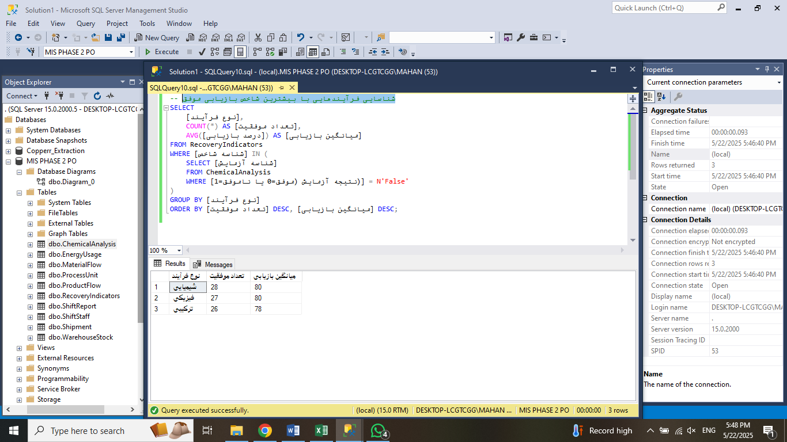 |
| **Q11** 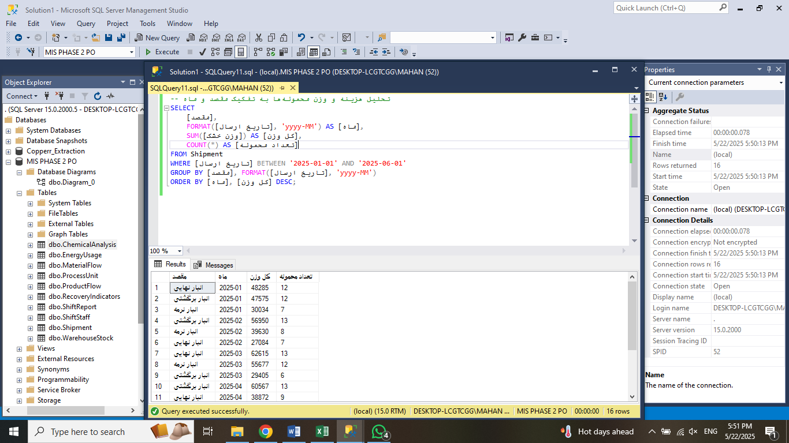 | **Q12** 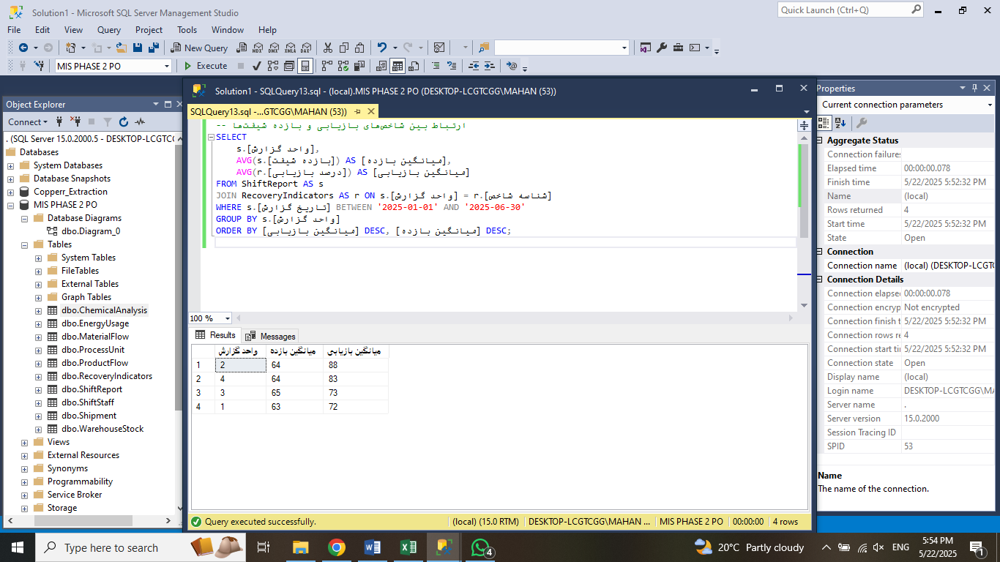 |
| **Q13** 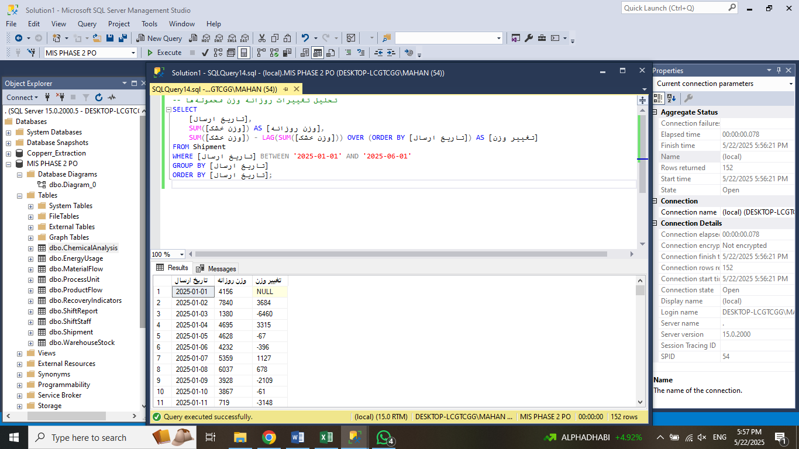 | **Q14** 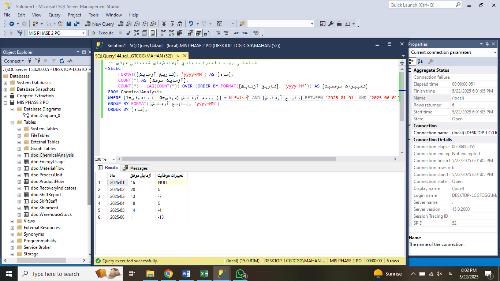 |

</details>
