# Phase 3: Power BI Dashboard

In the final phase I connected the Phase 2 dataset to **Power BI Desktop**, cleaned it with **Power Query**, built **DAX** measures and calculated tables, and designed a **four-page interactive report** with KPIs for chemical testing, shift performance and sales.

| File | Description |
|---|---|
| [`Dashboard.pbix`](Dashboard.pbix) | Power BI report (open with Power BI Desktop) |
| [`Dashboard_Export.pdf`](Dashboard_Export.pdf) | All four report pages, exported to PDF from Power BI Desktop |
| [`screenshots/`](screenshots) | The four report pages as images (from the Power BI export) |
| [`figures/`](figures) | Individual visuals |
| [`Phase3_Report_FA.pdf`](Phase3_Report_FA.pdf) | Original Persian report |

> In the `.pbix` model the columns keep their original Persian names. In the DAX below they are shown with their English equivalents from [Phase 2](../Phase_2_Database_and_SQL).

## Data preparation (Power Query)

- **Type change**: in `ChemicalAnalysis`, the test result column and in `ShiftReport`, the urgent-shift column were converted from 0/1 numbers to `True`/`False` text, so they could be used in the measures below.
- **Row removal**: the last row of every table (except `ShiftStaff` and `ProcessUnit`) was removed. It was the only record from a new month (1 June) and distorted the monthly visuals.

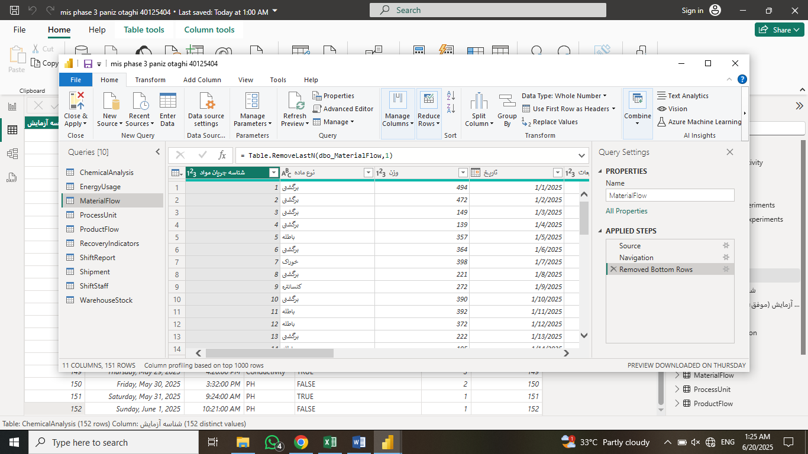

---

## Page 1: Chemical Analysis Report

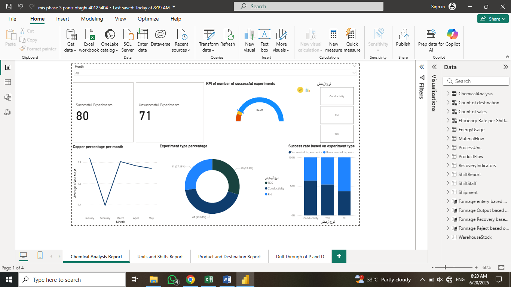

**Visuals**

- **Month slicer** and **test type slicer** (Conductivity, pH, TDS) filter the whole page.
- **Cards** show the number of successful and unsuccessful tests (80 and 71 for the whole period).
- **Success rate by test type** (100% stacked column): overall the success rates are close, with Conductivity the highest and pH the lowest. This changes from month to month.
- **Test type share** (donut): Conductivity is usually the most frequent test. In March and May TDS tests were more frequent, which lowered the number of successful tests.
- **Copper percentage per month** (line): February had more successful tests but a lower copper percentage. Lower-risk tests with lower extraction probably gave the higher success rate.

| | |
|---|---|
| 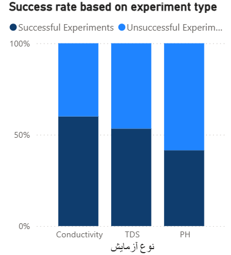 | 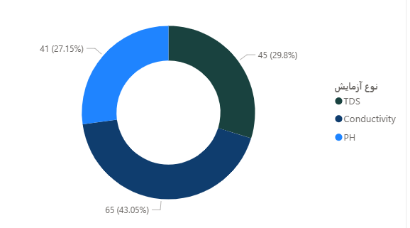 |
| 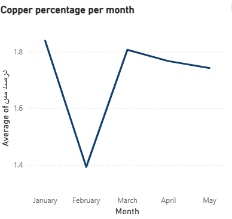 | 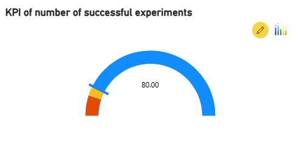 |

**KPI: successful tests per month**, gauge with a target of **15**. Red is 0–10, yellow 10–15 and blue 15 or more. The plant missed the target only in **March and May**. It can be improved by running more Conductivity tests, or better, by lowering the risk of the other two test types (more accurate testers and equipment, repeated tests, and a better testing system). The indicator is positive overall but very close to the target.

```dax
min successful experiments    = 0
max successful experiment     = 100
target successful experiment  = 15

Successful Experiments   = COUNTX(FILTER(ChemicalAnalysis, ChemicalAnalysis[TestResult] = "False"), ChemicalAnalysis[TestResult])
Unsuccessful Experiments = COUNTX(FILTER(ChemicalAnalysis, ChemicalAnalysis[TestResult] = "True"),  ChemicalAnalysis[TestResult])

Count Conductivity = COUNTX(FILTER(ChemicalAnalysis, ChemicalAnalysis[TestType] = "Conductivity"), ChemicalAnalysis[TestType])
Count PH           = COUNTX(FILTER(ChemicalAnalysis, ChemicalAnalysis[TestType] = "PH"),           ChemicalAnalysis[TestType])
Count TDS          = COUNTX(FILTER(ChemicalAnalysis, ChemicalAnalysis[TestType] = "TDS"),          ChemicalAnalysis[TestType])
```

(`TestResult` is 0 for a successful test, so after the type change a successful test reads `"False"`.)

**Conclusion.** More tests succeed when the extracted copper percentage is lower, and Conductivity tests carry less risk and succeed more often. Reducing errors and risk in the other two test types should be a priority, so that the plant reaches the monthly target every month.

---

## Page 2: Units and Shifts Report

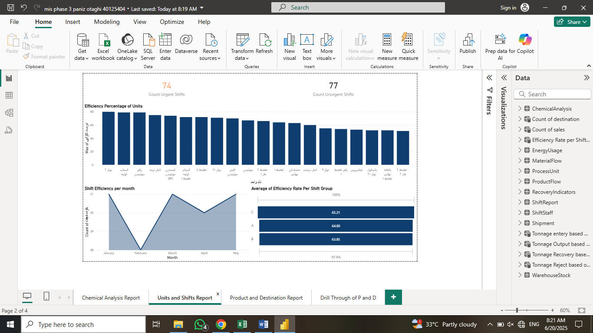

**Visuals**

- **Efficiency of process units** (column chart): shows which units are most efficient. Selecting a unit shows its urgent and non-urgent shifts in the KPI cards.
- **Shift efficiency per month** (area chart): shift performance over time. It also works as a month filter for the page.
- **Average efficiency per shift group** (funnel): shifts A, B and C have very similar efficiency (about 64–65%), so no major changes in staffing or timing are needed to balance them.

| | |
|---|---|
| 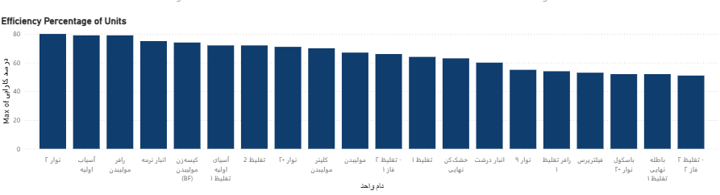 | 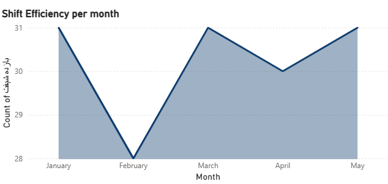 |
| 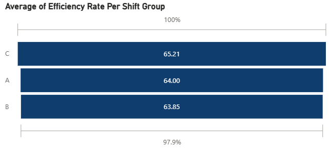 |  |

**KPI: urgent shifts.** Two advanced cards show the number of urgent and non-urgent shifts. The card turns red when a month has **15 or more urgent shifts**. The target was met in only two of the five months, but the last month moved toward fewer urgent shifts while shift efficiency rose. The target looks realistic if the units run efficiently.

```dax
Count Urgent Shifts   = COUNTX(FILTER(ShiftReport, ShiftReport[IsUrgentShift] = "True"),  ShiftReport[IsUrgentShift])
Count Unurgent Shifts = COUNTX(FILTER(ShiftReport, ShiftReport[IsUrgentShift] = "False"), ShiftReport[IsUrgentShift])

Efficiency Rate per Shift type =
    SUMMARIZECOLUMNS(ShiftReport[ShiftCode], "Efficiency Rate", AVERAGE(ShiftReport[ShiftEfficiency]))
```

**Conclusion.** The number of urgent shifts can be controlled and matters a lot: the plant should not be in an emergency state all the time. Systematically raising unit efficiency and shift performance reduces urgent shifts, which improves productivity over time.

---

## Page 3: Product and Destination Report

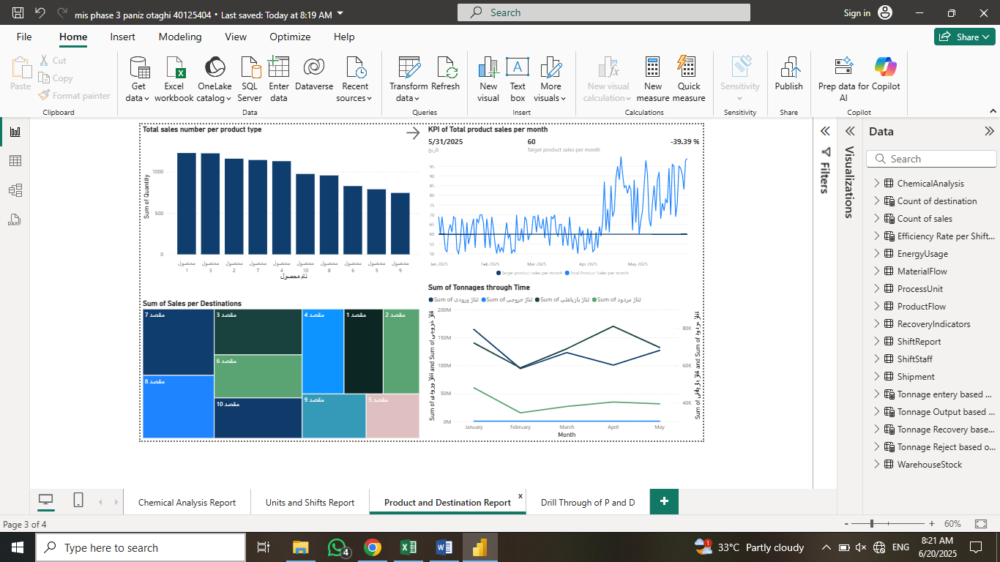

**Visuals**

- **Total sales per product** (bar chart): which products sell most, to support production and sales planning.
- **Tonnage over time** (line chart, two axes): input, output, recovered and rejected tonnage per month. It shows in which months recovery and waste were high relative to input, and whether this relates to the product mix. Recovery rose in the last two months, which also raised the number of products made (see the KPI).
- **Sales per destination** (treemap): which customers (destinations) buy most.

| | |
|---|---|
| 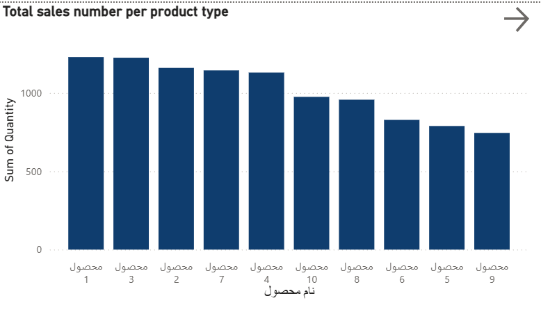 | 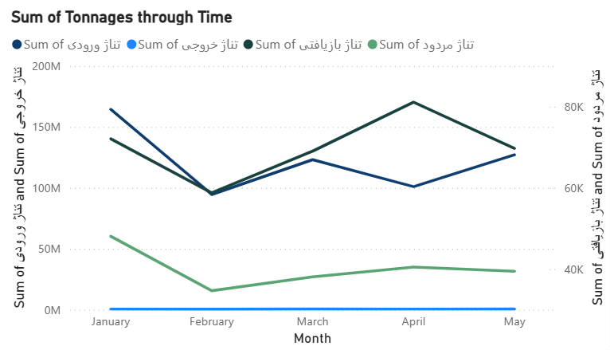 |
| 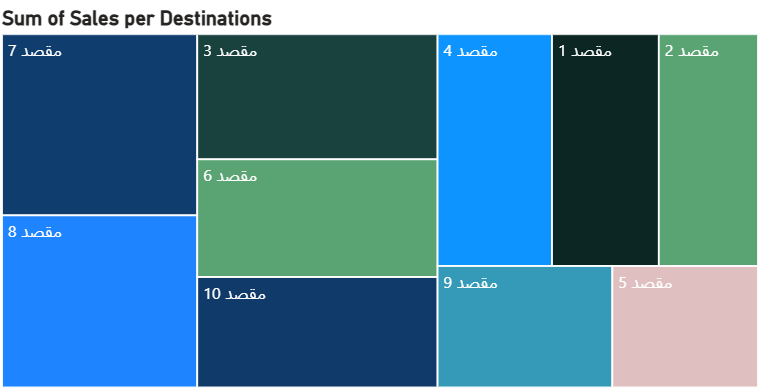 | 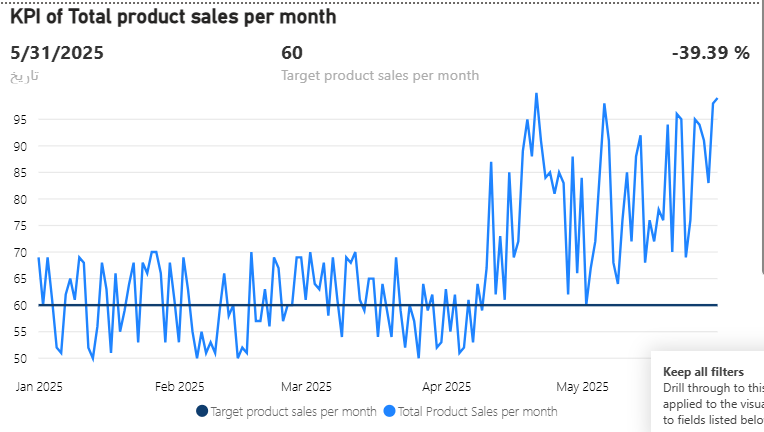 |

**KPI: monthly product sales**, a Power KPI with a target of **60** units per month. Performance was not always on target in the first months, but April and May improved strongly, in line with the other pages. If the trend continues a higher target can be set; for now 60 fits the data.

```dax
Count of sales =
    SUMMARIZECOLUMNS(ProductFlow[ProductName], "Quantity", SUM(ProductFlow[Quantity]))
Count of destination =
    SUMMARIZECOLUMNS(ProductFlow[Destination], "Sales of Destinations", COUNT(ProductFlow[ProductID]))

Tonnage entery based on product type   = SUMMARIZECOLUMNS(ProductFlow[ProductName], "Tonnage Entery",   SUM(ProductFlow[InputTonnage]))
Tonnage Output based on product type   = SUMMARIZECOLUMNS(ProductFlow[ProductName], "Tonnage Output",   SUM(ProductFlow[OutputTonnage]))
Tonnage Recovery based on product type = SUMMARIZECOLUMNS(ProductFlow[ProductName], "Tonnage Recovery", SUM(ProductFlow[RecoveredTonnage]))
Tonnage Reject based on product type   = SUMMARIZECOLUMNS(ProductFlow[ProductName], "Tonnage Reject",   SUM(ProductFlow[RejectedTonnage]))

Total Product Sales per month  = SUM(ProductFlow[Quantity])
Target product sales per month = 60
```

---

## Page 4: Drill-through (Products)

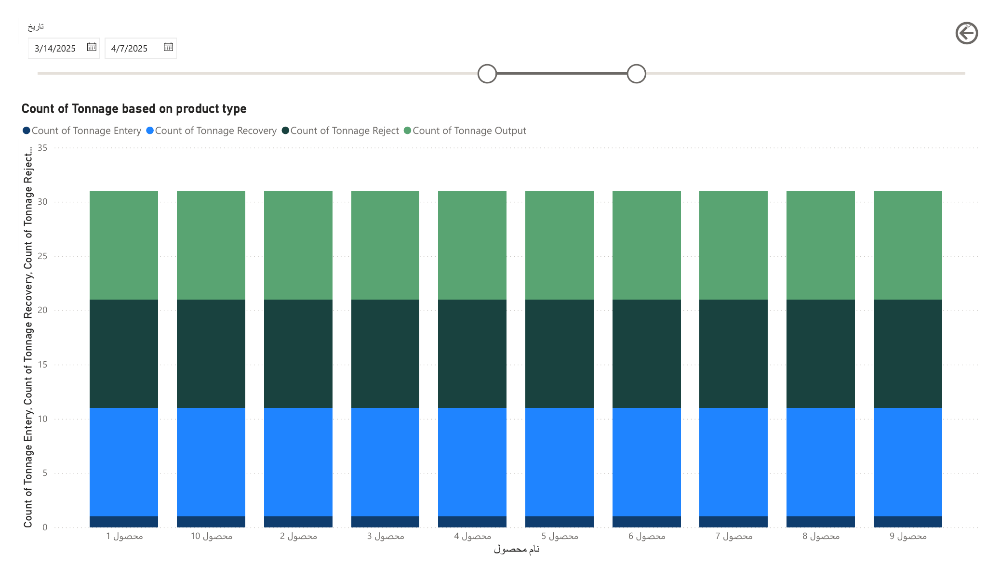

A drill-through page reached from the product visuals on page 3. It has a date slicer and a column chart of input, output, recovered and rejected tonnage for each product, which helps decide which products to focus on based on their sales and material needs.

**Conclusion for pages 3 and 4.** Products **1 and 3** sell the most, and destinations **7 and 8** buy the most, so the plant can focus production on these products and customers. The tonnage chart, the drill-through page and the KPI also show that recovery and recovered tonnage deserve more focus and investment, because they have a clear effect on the number of products made.
# Phase 3: Power BI Dashboard

In the final phase I connected the Phase 2 dataset to **Power BI Desktop**, cleaned it with **Power Query**, built **DAX** measures and calculated tables, and designed a **four-page interactive report** with KPIs for chemical testing, shift performance and sales.

| File | Description |
|---|---|
| [`Dashboard.pbix`](Dashboard.pbix) | Power BI report (open with Power BI Desktop) |
| [`screenshots/`](screenshots) | The four report pages |
| [`figures/`](figures) | Individual visuals |
| [`Phase3_Report_FA.pdf`](Phase3_Report_FA.pdf) | Original Persian report |

> In the `.pbix` model the columns keep their original Persian names. In the DAX below they are shown with their English equivalents from [Phase 2](../Phase_2_Database_and_SQL).

## Data preparation (Power Query)

- **Type change**: in `ChemicalAnalysis`, the test result column and in `ShiftReport`, the urgent-shift column were converted from 0/1 numbers to `True`/`False` text, so they could be used in the measures below.
- **Row removal**: the last row of every table (except `ShiftStaff` and `ProcessUnit`) was removed. It was the only record from a new month (1 June) and distorted the monthly visuals.


---

## Page 1: Chemical Analysis Report


**Visuals**

- **Month slicer** and **test type slicer** (Conductivity, pH, TDS) filter the whole page.
- **Cards** show the number of successful and unsuccessful tests (80 and 71 for the whole period).
- **Success rate by test type** (100% stacked column): overall the success rates are close, with Conductivity the highest and pH the lowest. This changes from month to month.
- **Test type share** (donut): Conductivity is usually the most frequent test. In March and May TDS tests were more frequent, which lowered the number of successful tests.
- **Copper percentage per month** (line): February had more successful tests but a lower copper percentage. Lower-risk tests with lower extraction probably gave the higher success rate.

| | |
|---|---|
|  |  |
|  |  |

**KPI: successful tests per month**, gauge with a target of **15**. Red is 0–10, yellow 10–15 and blue 15 or more. The plant missed the target only in **March and May**. It can be improved by running more Conductivity tests, or better, by lowering the risk of the other two test types (more accurate testers and equipment, repeated tests, and a better testing system). The indicator is positive overall but very close to the target.

```dax
min successful experiments    = 0
max successful experiment     = 100
target successful experiment  = 15

Successful Experiments   = COUNTX(FILTER(ChemicalAnalysis, ChemicalAnalysis[TestResult] = "False"), ChemicalAnalysis[TestResult])
Unsuccessful Experiments = COUNTX(FILTER(ChemicalAnalysis, ChemicalAnalysis[TestResult] = "True"),  ChemicalAnalysis[TestResult])

Count Conductivity = COUNTX(FILTER(ChemicalAnalysis, ChemicalAnalysis[TestType] = "Conductivity"), ChemicalAnalysis[TestType])
Count PH           = COUNTX(FILTER(ChemicalAnalysis, ChemicalAnalysis[TestType] = "PH"),           ChemicalAnalysis[TestType])
Count TDS          = COUNTX(FILTER(ChemicalAnalysis, ChemicalAnalysis[TestType] = "TDS"),          ChemicalAnalysis[TestType])
```

(`TestResult` is 0 for a successful test, so after the type change a successful test reads `"False"`.)

**Conclusion.** More tests succeed when the extracted copper percentage is lower, and Conductivity tests carry less risk and succeed more often. Reducing errors and risk in the other two test types should be a priority, so that the plant reaches the monthly target every month.

---

## Page 2: Units and Shifts Report


**Visuals**

- **Efficiency of process units** (column chart): shows which units are most efficient. Selecting a unit shows its urgent and non-urgent shifts in the KPI cards.
- **Shift efficiency per month** (area chart): shift performance over time. It also works as a month filter for the page.
- **Average efficiency per shift group** (funnel): shifts A, B and C have very similar efficiency (about 64–65%), so no major changes in staffing or timing are needed to balance them.

| | |
|---|---|
|  |  |
|  |  |

**KPI: urgent shifts.** Two advanced cards show the number of urgent and non-urgent shifts. The card turns red when a month has **15 or more urgent shifts**. The target was met in only two of the five months, but the last month moved toward fewer urgent shifts while shift efficiency rose. The target looks realistic if the units run efficiently.

```dax
Count Urgent Shifts   = COUNTX(FILTER(ShiftReport, ShiftReport[IsUrgentShift] = "True"),  ShiftReport[IsUrgentShift])
Count Unurgent Shifts = COUNTX(FILTER(ShiftReport, ShiftReport[IsUrgentShift] = "False"), ShiftReport[IsUrgentShift])

Efficiency Rate per Shift type =
    SUMMARIZECOLUMNS(ShiftReport[ShiftCode], "Efficiency Rate", AVERAGE(ShiftReport[ShiftEfficiency]))
```

**Conclusion.** The number of urgent shifts can be controlled and matters a lot: the plant should not be in an emergency state all the time. Systematically raising unit efficiency and shift performance reduces urgent shifts, which improves productivity over time.

---

## Page 3: Product and Destination Report


**Visuals**

- **Total sales per product** (bar chart): which products sell most, to support production and sales planning.
- **Tonnage over time** (line chart, two axes): input, output, recovered and rejected tonnage per month. It shows in which months recovery and waste were high relative to input, and whether this relates to the product mix. Recovery rose in the last two months, which also raised the number of products made (see the KPI).
- **Sales per destination** (treemap): which customers (destinations) buy most.

| | |
|---|---|
|  |  |
|  |  |

**KPI: monthly product sales**, a Power KPI with a target of **60** units per month. Performance was not always on target in the first months, but April and May improved strongly, in line with the other pages. If the trend continues a higher target can be set; for now 60 fits the data.

```dax
Count of sales =
    SUMMARIZECOLUMNS(ProductFlow[ProductName], "Quantity", SUM(ProductFlow[Quantity]))
Count of destination =
    SUMMARIZECOLUMNS(ProductFlow[Destination], "Sales of Destinations", COUNT(ProductFlow[ProductID]))

Tonnage entery based on product type   = SUMMARIZECOLUMNS(ProductFlow[ProductName], "Tonnage Entery",   SUM(ProductFlow[InputTonnage]))
Tonnage Output based on product type   = SUMMARIZECOLUMNS(ProductFlow[ProductName], "Tonnage Output",   SUM(ProductFlow[OutputTonnage]))
Tonnage Recovery based on product type = SUMMARIZECOLUMNS(ProductFlow[ProductName], "Tonnage Recovery", SUM(ProductFlow[RecoveredTonnage]))
Tonnage Reject based on product type   = SUMMARIZECOLUMNS(ProductFlow[ProductName], "Tonnage Reject",   SUM(ProductFlow[RejectedTonnage]))

Total Product Sales per month  = SUM(ProductFlow[Quantity])
Target product sales per month = 60
```

---

## Page 4: Drill-through (Products)


A drill-through page reached from the product visuals on page 3. It has a date slicer and a column chart of input, output, recovered and rejected tonnage for each product, which helps decide which products to focus on based on their sales and material needs.

**Conclusion for pages 3 and 4.** Products **1 and 3** sell the most, and destinations **7 and 8** buy the most, so the plant can focus production on these products and customers. The tonnage chart, the drill-through page and the KPI also show that recovery and recovered tonnage deserve more focus and investment, because they have a clear effect on the number of products made.
